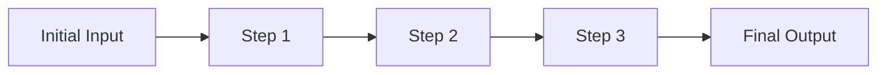
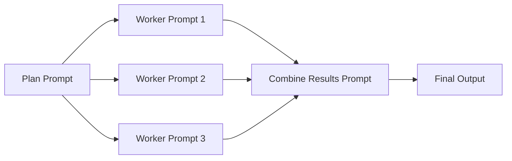
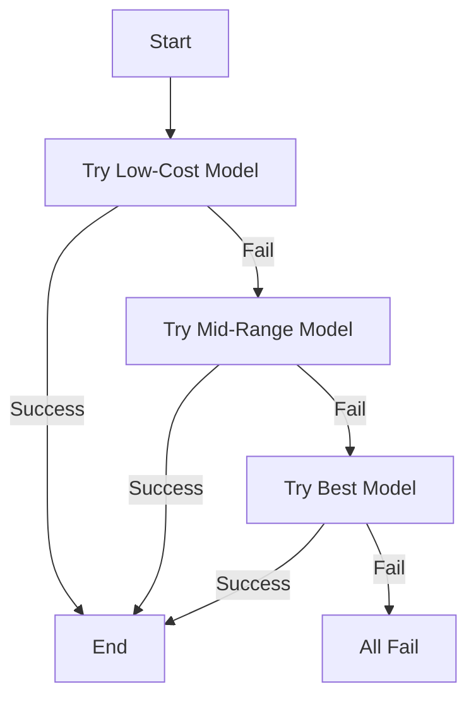
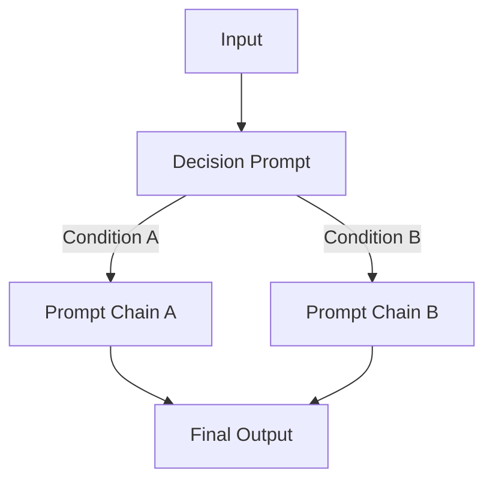
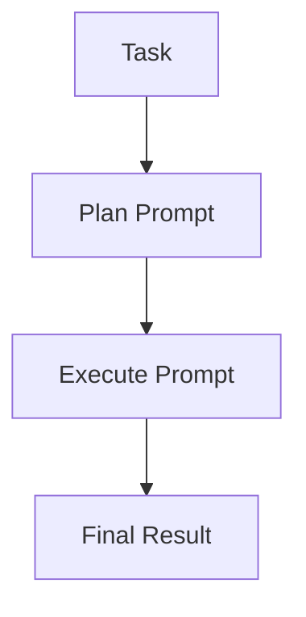
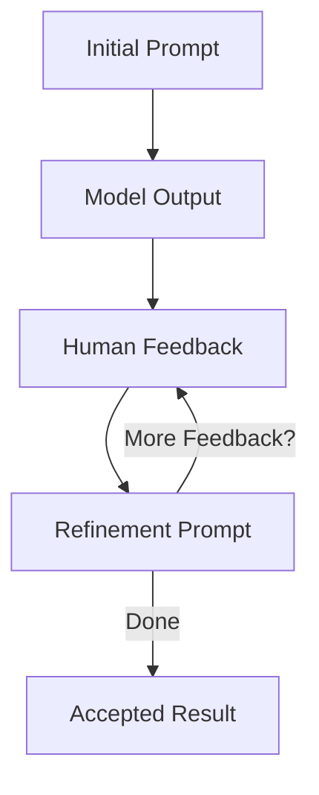
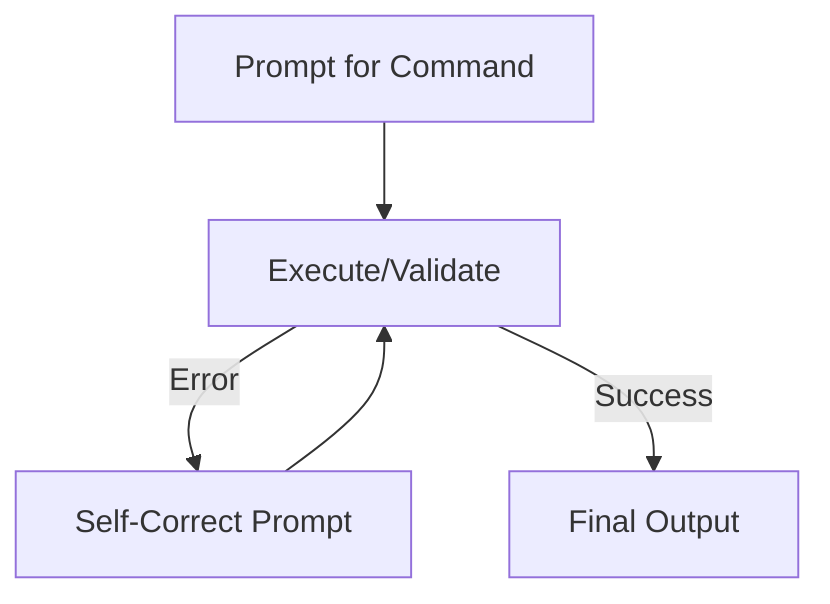

# Unlock the Power of LLMs: Mastering Prompt Chaining for Enhanced Results

Large Language Models (LLMs) are revolutionizing how we approach tasks in research, industry, and education. From generating creative content to assisting with complex coding challenges, LLMs are incredibly powerful tools. However, simply throwing a single prompt at an LLM isn't always the most effective strategy. A more nuanced approach involves chaining multiple prompts together – a technique known as *prompt chaining*. This structured method allows you to incrementally build ideas, incorporate decision-making, establish fallback mechanisms, and continuously refine your results.

By breaking down large, complex tasks into smaller, more manageable steps, each individual prompt can concentrate on a specific aspect of the overall goal. This helps maintain clarity, adaptability, and higher-quality outputs. Think of it like a recipe – you wouldn't bake a cake in a single step!

### Why Prompt Chaining is a Game Changer

Why should you invest time in mastering prompt chaining?

-   __Incremental Complexity:__ Start with the basics and build up complexity gradually across several steps.
-   __Modular Reasoning:__ Isolate different concerns (like planning, executing, and validating) into separate prompts.
-   __Adaptive Workflows:__ Make your process smarter by implementing conditional logic for path selection and backup models for robust results.
-   __Human-Model Collaboration:__ Create feedback loops that integrate human insights or self-correction methods for continuous enhancement.

Combined with unique domain knowledge, the right sequence of prompts can result in products and tools worth five, six, or even seven figures. By strategically leveraging prompt chaining, you can build agentic software that works on your behalf to create exceptional value for both you and your users.

Here are some common prompt chaining patterns, each with:

-   A clear conceptual description
-   A visual diagram to enhance understanding
-   Examples to illustrate the pattern
-   Pseudocode to clarify the logic


## The Snowball Prompt Chain: Building Momentum

-   __Concept:__ Start with a simple piece of information and gradually "snowball" it into something richer and more complete.
-   __Analogy:__ Think of starting with a single snowflake and watching it grow into a snowball as it rolls down a hill.
-   __Example:__ Begin with a topic, generate a title, create an outline, develop a full draft, and finally, format it for publication.

> The Snowball approach ensures that each subsequent prompt benefits from and is constrained by the previous output, which helps maintain coherence and a logical flow. This pattern is ideal for generating reusable content like blogs, newsletters, or research reports.



### Examples:

1. Blog Post Development
   ```
   Initial Prompt:
   "Topic: Benefits of meditation"

   Second Prompt (using previous output):
   "Generate a compelling title for an article about [meditation benefits]"

   Third Prompt:
   "Create a detailed outline for the article titled [Meditation: Your Path to Daily Calm]"

   Fourth Prompt:
   "Write an introduction paragraph based on [outline]"

   Final Prompt:
   "Develop a complete article incorporating [introduction] and [outline]"
   ```

2. Product Description Creation
   ```
   Initial Prompt:
   "Product: Wireless earbuds"

   Second Prompt:
   "List key features and specifications of [wireless earbuds]"

   Third Prompt:
   "Create benefit statements for each [feature]"

   Fourth Prompt:
   "Develop user scenarios using [benefits]"

   Final Prompt:
   "Write a compelling product description combining [features], [benefits], and [scenarios]"
   ```

3. Story Development
   ```
   Initial Prompt:
   "Character: A time-traveling librarian"

   Second Prompt:
   "Develop background story for [character]"

   Third Prompt:
   "Create a conflict scenario involving [character background]"

   Fourth Prompt:
   "Write key plot points building from [conflict]"

   Final Prompt:
   "Draft a complete short story incorporating [character], [background], [conflict], and [plot points]"
   ```

```bash
topic = "The Impact of AI on Healthcare"
title = LLM.prompt("Create a catchy title from: " + topic)
outline = LLM.prompt("Generate an outline based on: " + title)
full_content = LLM.prompt("Expand this outline into a full draft: " + outline)
formatted_post = LLM.prompt("Format this content into markdown: " + full_content)
```

## Workers Prompt Chain: Divide and Conquer

- __Concept:__ Assign individual "worker" prompts to handle different subtasks. Each worker focuses on a specific piece of the larger problem. A synthesis prompt aggregates the outputs.
- __Analogy:__ Imagine a team of specialists each contributing their expertise to complete a project.
- __Example:__ Begin with a topic, generate a title, create an outline, develop a full draft, and finally, format it for publication.

> The Workers pattern promotes modularity. Each worker focuses on a specific piece, making the overall process more manageable and robust. This is especially powerful for applications like research tools, content creation, and coding assistance.



### Examples:

1. Research Project
   ```
   Worker 1 (Literature Review):
   "Search and summarize recent papers on AI ethics"

   Worker 2 (Data Collection):
   "Gather relevant statistics and case studies"

   Worker 3 (Analysis):
   "Identify key patterns and trends"

   Synthesis:
   Combine findings into a comprehensive research report
   ```

2. Parallel Processing Tasks
   ```
   Worker 1:
   "Process customer feedback from Q1"

   Worker 2:
   "Process customer feedback from Q2"

   Worker 3:
   "Process customer feedback from Q3"

   Synthesis:
   Aggregate insights from all quarters
   ```

3. Autocomplete System
   ```
   Worker 1 (Context Analysis):
   "Analyze user's typing pattern"

   Worker 2 (Suggestion Generation):
   "Generate relevant word suggestions"

   Worker 3 (Ranking):
   "Rank suggestions by relevance"

   Synthesis:
   Present top suggestions to user
   ```

4. Similar Tasks Scaling
   ```
   Worker 1:
   "Translate document to Spanish"

   Worker 2:
   "Translate document to French"

   Worker 3:
   "Translate document to German"

   Synthesis:
   Compile all translations into a multilingual document
   ```

```bash
plan = LLM.prompt("Create a plan with three subtasks for generating a marketing report.")
(subtask1, subtask2, subtask3) = parse_subtasks(plan)

result1 = LLM.prompt("Complete this subtask: " + subtask1)
result2 = LLM.prompt("Complete this subtask: " + subtask2)
result3 = LLM.prompt("Complete this subtask: " + subtask3)

final_result = LLM.prompt("Combine these results into a cohesive report: " + result1 + ", " + result2 + ", " + result3)
```


## Fallback Prompt Chain: Resourceful Model Selection

-   __Concept:__ Begin with a simple, cheaper, or faster model and attempt to solve the task. If it fails or provides inadequate results, move to a more advanced and potentially more expensive model.
-   __Analogy:__ Think of a backup system that kicks in when the primary system doesn’t work.

*Note:* The Fallback pattern optimizes cost by using more advanced options only when simpler ones fail. This pattern can be extended to dynamic systems that adjust prompts and outputs based on real-time conditions, enhancing reliability and efficiency.



```python
# Try with basic model first
result = basic_model.prompt(input)
if validate(result):
    return result

# Try mid-tier model if basic fails
result = mid_tier_model.prompt(input)
if validate(result):
    return result

# Try advanced model as last resort
result = advanced_model.prompt(input)
if validate(result):
    return result

# If all models fail, return error message
return "No valid solution found"
```

## Decision Maker Prompt Chain: Adaptive Workflows

- __Concept:__ Use a dedicated prompt to analyze conditions and intelligently select the most appropriate subsequent chain of prompts. This creates dynamic workflows that adapt based on context, sentiment, complexity, or other factors.

- __Analogy:__ Think of a skilled project manager who evaluates a situation and assigns the right team with the right approach for each unique challenge.

- __Example:__ Analyze customer feedback sentiment to determine whether to trigger a satisfaction enhancement workflow or a complaint resolution workflow.

> The Decision Maker pattern enables intelligent branching in your prompt chains, making them more responsive to specific situations and requirements. This is particularly valuable for customer service, content moderation, and adaptive learning systems.



### Examples:

1. Content Moderation System
   ```
   Decision Prompt:
   "Analyze content type and risk level of: [user submission]"

   If high_risk:
       Execute detailed review chain
   Else if medium_risk:
       Execute standard review chain
   Else:
       Execute fast-track approval chain
   ```

2. Customer Support Router
   ```
   Decision Prompt:
   "Determine urgency and category of: [customer inquiry]"

   If urgent:
       Route to immediate response chain
   Else if technical:
       Route to technical support chain
   Else:
       Route to general support chain
   ```

3. Learning Path Selection
   ```
   Decision Prompt:
   "Evaluate student's current understanding of: [topic]"

   If beginner:
       Execute fundamentals chain
   Else if intermediate:
       Execute advanced concepts chain
   Else:
       Execute expert material chain
   ```

```python
# Analyze input and determine processing path
analysis = LLM.prompt("Analyze input for: complexity, sentiment, urgency, expertise")

# Extract routing decision
decision = parse_analysis(analysis)

# Route to appropriate chain
if decision.complexity is "high":
    result = expert_chain.process(input)
elif decision.urgency is "immediate":
    result = urgent_chain.process(input)
else:
    result = standard_chain.process(input)

return result
```

*Note:* The Decision Maker pattern transforms static prompt chains into intelligent workflows that can adapt to different scenarios. This flexibility is crucial for building robust applications that can handle diverse inputs and requirements effectively.


## Plan-Execute Prompt Chain: Strategic Implementation

- __Concept:__ Separate the reasoning/planning phase from the execution phase to ensure more thoughtful and structured results. The planning prompt creates a strategic approach, while the execution prompt implements it.
- __Analogy:__ Similar to an architect first creating detailed blueprints before actual construction begins.
- __Example:__ When designing a complex system, first outline the architecture and components, then implement each part according to the plan.

### Key Benefits:

- __Improved Structure:__ Forces a methodical approach to problem-solving
- __Better Error Prevention:__ Catches potential issues during the planning phase
- __Enhanced Clarity:__ Creates clear documentation of the thought process
- __Easier Validation:__ Allows for plan review before committing to execution
- __Reusable Components:__ Plans can be saved and reused for similar tasks

> The Plan-Execute pattern promotes methodical problem-solving by ensuring thorough planning before implementation. This approach reduces errors and improves the overall quality of outputs.



### Examples:

1. Software Architecture Design
   ```
   Plan Prompt:
   "Create a detailed plan for building a microservices-based e-commerce system"

   Execute Prompt:
   "Based on the architecture plan, provide detailed implementation specifications for each service"
   ```

2. Content Creation Strategy
   ```
   Plan Prompt:
   "Develop a content strategy for launching a new product"

   Execute Prompt:
   "Using the content strategy, generate specific content pieces for each channel"
   ```

3. Research Project Organization
   ```
   Plan Prompt:
   "Outline the methodology for studying climate change impacts"

   Execute Prompt:
   "Following the methodology, detail the specific research steps and data collection methods"
   ```

```python
# Generate initial plan
plan = LLM.prompt("Plan task: " + task)
if not validate(plan):
    return "Failed to generate valid plan"

# Execute each step of the plan
result = LLM.prompt("Execute plan: " + plan)
if not validate(result):
    return "Failed to execute plan"

# Return final result
return result

# Example usage
task = "Design an AI-powered recommendation system"
final_result = LLM.prompt(task)
```


## Human-in-the-Loop Prompt Chain: Collaborative Refinement

- __Concept:__ Integrate human feedback into the prompt chain workflow. The LLM generates initial content, humans provide feedback, and subsequent prompts refine the output based on that feedback.

- __Analogy:__ Like an editor and writer working together, where the writer (LLM) produces content and the editor (human) provides guidance for improvements.

- __Example:__ Iteratively developing a marketing strategy where human experts can validate and refine the AI's suggestions.

> The Human-in-the-Loop pattern combines the efficiency of AI with human expertise and judgment, resulting in higher quality outputs that better align with specific needs and constraints.



### Examples:

1. Content Development
   ```
   Initial Prompt:
   "Write a blog post about sustainable living"

   Human Feedback:
   "Need more focus on practical tips"

   Refinement Prompt:
   "Revise the blog post to include more actionable advice while maintaining the current structure"
   ```

2. Design Iteration
   ```
   Initial Prompt:
   "Create a website layout description"

   Human Feedback:
   "Navigation needs to be more accessible"

   Refinement Prompt:
   "Modify the layout with emphasis on navigation accessibility, incorporating previous design elements"
   ```

3. Code Review
   ```
   Initial Prompt:
   "Generate a Python function for data processing"

   Human Feedback:
   "Need better error handling"

   Refinement Prompt:
   "Enhance the function with comprehensive error handling while maintaining current functionality"
   ```

```python
# Generate initial output
output = LLM.prompt(initial_prompt)
iteration = 1

# Start feedback loop
while true:
    # Show current version
    print("Iteration " + iteration + ": " + output)

    # Get human feedback
    feedback = input("Provide feedback (or 'done' to finish): ")

    if feedback == "done":
        break

    # Generate refined version based on feedback
    refinement_prompt = "Previous output: " + output + "\n" +
                       "Human feedback: " + feedback + "\n" +
                       "Revise the output incorporating this feedback"

    output = LLM.prompt(refinement_prompt)
    iteration = iteration + 1

# Return final version
return output

# Example usage
initial_prompt = "Generate a product description for an eco-friendly water bottle"
final_result = HumanInTheLoop.run(initial_prompt)
```


## Self-Correct Prompt Chain: Autonomous Error Recovery

- __Concept:__ Implement a feedback loop where the model evaluates and corrects its own output. When errors or suboptimal results are detected, the model automatically attempts to improve its response.

- __Analogy:__ Like a self-debugging program that can identify and fix its own issues.

- __Example:__ Generating and validating code, where the model can detect syntax errors and fix them automatically.

> The Self-Correct pattern enhances reliability by enabling autonomous error detection and correction, reducing the need for human intervention in handling common issues.



### Examples:

1. Code Generation
   ```
   Initial Prompt:
   "Write a function to calculate factorial"

   Validation:
   "Test function with inputs: -1, 0, 5"

   Self-Correct Prompt:
   "Function fails for negative numbers. Add input validation"
   ```

2. Query Generation
   ```
   Initial Prompt:
   "Create SQL query to find active users"

   Validation:
   "Check query syntax and performance"

   Self-Correct Prompt:
   "Query is missing index usage. Optimize for performance"
   ```

3. Content Validation
   ```
   Initial Prompt:
   "Write a technical tutorial"

   Validation:
   "Check for technical accuracy and completeness"

   Self-Correct Prompt:
   "Step 3 is unclear. Provide more detailed explanation"
   ```

```python
# Initialize variables
max_attempts = 3
attempt = 1
current_output = LLM.prompt(initial_prompt)

# Start correction loop
while attempt <= max_attempts:
    # Validate current output
    validation_prompt = "Validate output for correctness and completeness: " + current_output
    validation_result = LLM.prompt(validation_prompt)

    # Check if output is valid
    if validation_result == "VALID":
        return current_output

    # Generate correction if invalid
    correction_prompt = "Previous output: " + current_output + "\n" +
                       "Validation issues: " + validation_result + "\n" +
                       "Provide corrected version addressing these issues"

    current_output = LLM.prompt(correction_prompt)
    attempt = attempt + 1

# Return best attempt if max attempts reached
return current_output

# Example usage
initial_prompt = "Generate a regex pattern to validate email addresses"
final_result = SelfCorrect.run(initial_prompt)
```

## Additional Tips for Mastery

*   __Iterate:__ Begin with simpler chains before trying more complex ones.
*   __Validate:__ Add validation prompts to ensure quality and accuracy.
*   __Integrate:__ Use external tools, databases, or APIs to enhance your chains.
*   __Optimize:__ Use fallback patterns and logic to manage resources and performance.

## Ready to Learn More?

The concepts provided here have been distilled from the excellent videos provided by [Indy Dev Dan](https://www.youtube.com/@indydevdan).

Here are some additionalresources to dive deeper:

*   [Language Models are Few-Shot Learners](https://arxiv.org/abs/2005.14165) - Brown, T. et al. (2020)
*   [Chain-of-Thought Prompting Elicits Reasoning in Large Language Models](https://arxiv.org/abs/2201.11903) - Wei, J. et al. (2022)
*   [The Building Blocks of Interpretability: Toward Transparent, Modular LLM Systems](https://aclanthology.org/2023.emnlp-main.513/) - Goyal, N. et al. (2023)
*   [Best Practices for Prompt Engineering](https://platform.openai.com/docs/guides/gpt-best-practices) - OpenAI (2023)

## Conclusion

Prompt chaining isn't just a fancy technique; it's a fundamental strategy for getting the best out of LLMs. By understanding and utilizing these patterns, you can tackle complex tasks with more precision, adaptability, and control. With thoughtful integration of models, conditional logic, and human oversight, you can unlock their full potential to create agentic software that transforms ideas into impactful applications. So, start experimenting, ask questions, and unlock the full potential of these remarkable tools.


# Sample Code Project

This section demonstrates different prompt chain patterns using various LLM models (Google Gemini and Anthropic Claude).

## Setup

1. Install dependencies:
```bash
uv pip install llm
```

2. Create and activate a virtual environment using uv:
```bash
uv venv
source .venv/bin/activate  # On Windows use: .venv\Scripts\activate
```

3. Install required packages:
```bash
uv pip install llm openai python-dotenv llm-claude-3 anthropic google-generativeai
```

4. Create a `.env` file in the root directory with your API keys:
```
ANTHROPIC_API_KEY=your_anthropic_key_here
OPENAI_API_KEY=your_openai_key_here
```

5. Run the application:
```bash
uv run main.py
```

## Usage

Run the application with your chosen model and prompt chain:

```bash
uv run main.py --model [gemini|haiku|sonnet|opus] --chain [snowball|workers|fallback|decision|plan|human|self-correct]
```

Examples:
```bash
# Run default (Gemini model with snowball chain)
uv run main.py

# Use Gemini model with workers chain
uv run main.py --chain workers

# Use Claude 3 Haiku with fallback chain
uv run main.py --model haiku --chain fallback

# Use Claude 3 Sonnet with decision maker chain
uv run main.py --model sonnet --chain decision
```

### Available Prompt Chains

- `snowball`: Builds information progressively (default)
- `workers`: Delegates tasks to individual prompts
- `fallback`: Uses multiple models with fallback logic
- `decision`: Uses prompts to control flow
- `plan`: Separates planning and execution
- `human`: Incorporates human feedback
- `self-correct`: Reviews and corrects its own output

## Required Dependencies
- llm
- openai
- python-dotenv
- llm-claude-3
- anthropic
- google-generativeai

## Features
- Demonstrates basic setup of Anthropic's Claude client
- Shows integration with multiple LLM libraries
- Simple Hello World interaction with Claude-3

## Note
Make sure to replace the API keys in `.env` with your actual keys. Never commit API keys to version control.
